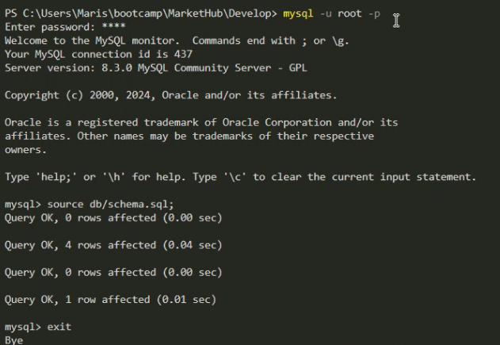
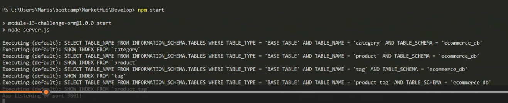
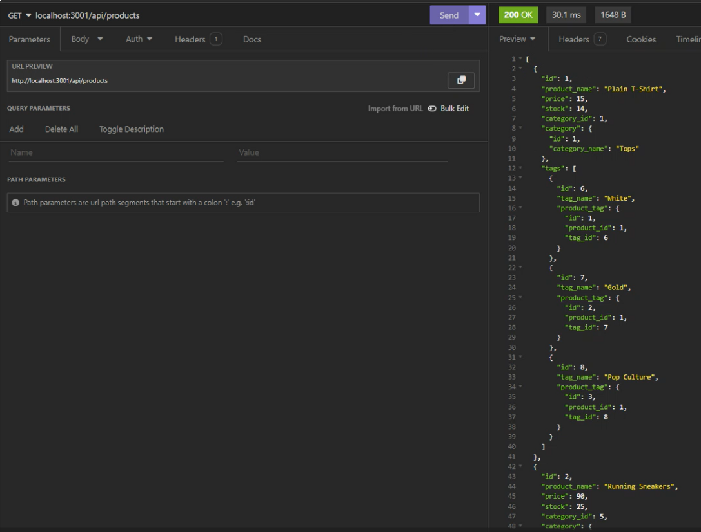

# MarketHub
Module 13 Challenge

## My Task

My challenge is to build the back end for an e-commerce site. I'll take a working Express.js API and configure it to use Sequelize to interact with a MySQL database.

## User Story
```

AS A manager at an internet retail company
I WANT a back end for my e-commerce website that uses the latest technologies
SO THAT my company can compete with other e-commerce companies

```

## Acceptance Criteria
```

GIVEN a functional Express.js API
WHEN I add my database name, MySQL username, and MySQL password to an environment variable file
THEN I am able to connect to a database using Sequelize
WHEN I enter schema and seed commands
THEN a development database is created and is seeded with test data
WHEN I enter the command to invoke the application
THEN my server is started and the Sequelize models are synced to the MySQL database
WHEN I open API GET routes in Insomnia Core for categories, products, or tags
THEN the data for each of these routes is displayed in a formatted JSON
WHEN I test API POST, PUT, and DELETE routes in Insomnia Core
THEN I am able to successfully create, update, and delete data in my database

```

## Screenshots

Sql & Schema: 


Seeds: 


npm start: 


Testing in Insomnia



## Links

Link to GitHub: https://github.com/Marisol514/MarketHub

Link to Recording: https://drive.google.com/file/d/1zVD5lBavfQ9o7m7lehuvkWbsecnHLMMA/view


## Resources

init npm -y: https://docs.npmjs.com/cli/v8/commands/npm-init

Inquirer: https://www.npmjs.com/package/inquirer/v/8.2.4#installation

ORM: https://stackoverflow.com/questions/1279613/what-is-an-orm-how-does-it-work-and-how-should-i-use-one

ORM: https://en.wikipedia.org/wiki/Object%E2%80%93role_modeling

ORM: https://dev.to/harshhhdev/why-orms-arent-always-a-great-idea-41kg

List of Object-Relational mapping Softwarre: https://en.wikipedia.org/wiki/List_of_object%E2%80%93relational_mapping_software

